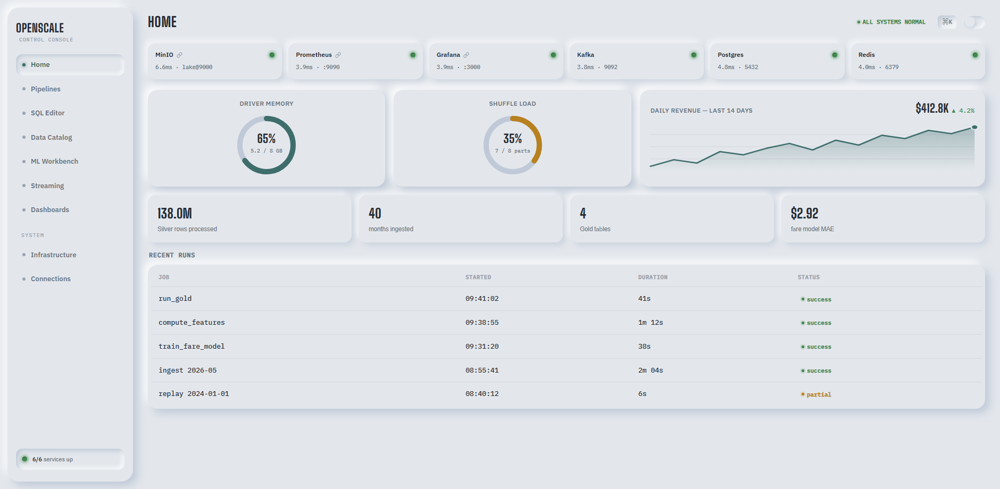

# OpenScale



A self-hosted, generic data-platform control console — the thing you'd reach
for instead of Databricks. One UI for pipelines, a SQL editor, a data
catalog, an ML workbench, streaming, dashboards, and the infrastructure
underneath all of it.

The repo currently holds two things:

- **The platform** (`frontend/` + `control-plane/`) — the generic console
  itself, in active development.
- **[`etl-exposure/`](etl-exposure/)** — a complete, working NYC Yellow
  Taxi lakehouse pipeline (Bronze/Silver/Gold, streaming, feature store, ML,
  API, Grafana dashboards), built first as a proof of what a real data
  platform needs. It's the platform's first target workload, not the
  platform — **treated as reference/legacy code**: nothing in `frontend/`
  or `control-plane/` imports from it.

See [`ideas/vision-and-roadmap.md`](ideas/vision-and-roadmap.md) for the
full product vision and phased roadmap, and
[`ideas/tech-stack.md`](ideas/tech-stack.md) for the reasoning behind every
technology choice below.

## Quickstart

**Prerequisites:** Docker Desktop, Node.js 20+, Go 1.26+ (only needed if
you want to run the control-plane outside Docker for hot-reload).

```bash
# 1. Bring up the whole backend stack (MinIO, Kafka, Postgres, Redis,
#    Prometheus, Grafana, and the control-plane itself) as one project.
docker compose up -d --build

# 2. Run the frontend dev server separately (fast HMR, not containerized).
cd frontend
npm install
npm run dev
```

Open **http://localhost:5173**. The console talks to the control-plane at
`http://localhost:8080` (override with `VITE_API_BASE_URL` if needed).

## Architecture

```
┌─────────────┐   HTTP (JSON)   ┌──────────────────┐   Docker Engine API   ┌──────────────────────────┐
│  frontend   │ ───────────────▶│   control-plane   │──────────────────────▶│  Docker daemon           │
│  React/Vite │                 │   Go / chi        │                        │  (MinIO, Kafka, Postgres,│
│  :5173      │◀─────────────── │   :8080           │◀───────────────────────│   Redis, Prometheus,     │
└─────────────┘   status JSON   └──────────────────┘   container state       │   Grafana containers)    │
                                                                              └──────────────────────────┘
```

The frontend never talks to Docker, Postgres, or anything else directly —
every data source is fronted by the Go control-plane over a versioned HTTP
API. Each frontend domain reads through a **gateway interface it owns**
(mock or HTTP implementation swapped behind one line), so screens not yet
backed by a real endpoint show an honest "not built yet" placeholder
instead of fake data.

## Repo layout

```
control-plane/     Go backend — cmd/server + internal/{api,docker,health,config}
frontend/           React 19 + TypeScript + Vite console, one domain per screen (DDD-structured)
etl-exposure/        The NYC taxi lakehouse pipeline -- reference/legacy, not a dependency
ideas/                 Vision, roadmap, and tech-stack decision docs
observability/          Prometheus scrape config + Grafana provisioning, owned by the root compose stack
docker-compose.yml       The full backend stack, one "openscale" compose project
```

## What's actually built

Honesty over hype — this is what's real today, not the roadmap:

| Area | Status |
|---|---|
| Frontend shell (sidebar, top bar, routing, light/dark/flat themes, responsive layout) | Done |
| System health (`GET /api/system-health`) — real Docker container inspection | Done |
| Container control (`POST /api/services/{id}/start\|stop\|restart`) | Done |
| Home screen (service health strip, resource gauges, revenue trend, recent runs) | Done, backed by mock data — no job-history endpoint yet |
| Infrastructure screen | Done — real data, real start/stop/restart controls |
| Connections screen (appearance settings) | Done |
| Pipelines, SQL Editor, Data Catalog, ML Workbench, Streaming, Dashboards | Placeholder screens — each names the backend endpoint it's waiting on |
| Pipeline execution, data catalog, SQL editor, ML workbench, generic connectors | Not started (see roadmap Phases 1-5) |

## Tech stack

| Layer | Pick |
|---|---|
| Frontend | React 19, TypeScript, Vite, Tailwind CSS v4, TanStack Query, React Router v7, Zustand |
| Backend | Go, [chi](https://github.com/go-chi/chi) router, [docker/docker](https://pkg.go.dev/github.com/docker/docker/client) Engine API SDK, zerolog, caarlos0/env |
| Infra (this stack) | MinIO, Kafka, Postgres, Redis, Prometheus, Grafana — all Dockerized |
| Design system | Custom neomorphic/skeuomorphic component set (not a UI kit) — dual soft-shadow tokens, light/dark/flat themes, self-hosted fonts |

Full rationale for each pick, including what was considered and rejected
(Next.js, shadcn, Python for the control-plane), is in
[`ideas/tech-stack.md`](ideas/tech-stack.md).

## Development

### Control-plane (Go)

```bash
cd control-plane
go run ./cmd/server        # :8080, reads Docker via the platform default socket/pipe
go build ./...
go vet ./...
```

Config is env-driven (see `internal/config/config.go`):

| Var | Default | Meaning |
|---|---|---|
| `PORT` | `8080` | HTTP listen port |
| `FRONTEND_ORIGIN` | `http://localhost:5173` | CORS-allowed origin |
| `DOCKER_HOST` | *(SDK default)* | Override the Docker Engine API endpoint |

### Frontend (React)

```bash
cd frontend
npm run dev      # Vite dev server, :5173
npm run build    # tsc -b && vite build
npm run lint      # oxlint
```

`VITE_API_BASE_URL` (default `http://localhost:8080`) points the frontend
at the control-plane.

### Full stack via Docker

```bash
docker compose up -d --build   # everything except the frontend dev server
docker compose ps
docker compose logs -f control-plane
```

The compose project is named `openscale`; all six infra services plus the
control-plane run under it. `etl-exposure/docker-compose.yml` still exists
but is superseded — don't run both at once, they define containers with the
same names.

## Design principles this codebase follows

- **Domain-Driven Design** — each frontend screen is a self-contained
  domain (`domain/`, `application/`, `infrastructure/`, `ui/`); the Go
  backend separates transport (`internal/api`) from the Docker adapter
  (`internal/docker`) from pure domain types (`internal/health`).
- **Dependency inversion** — frontend hooks depend on gateway *interfaces*
  they own, never on a concrete HTTP client; swapping mock → real is a
  one-line change per domain.
- **No fake data in real screens, no fake controls on real data** — a
  screen either has a real backend behind it, or it says so.
- **`etl-exposure/` is read-only history** — copy logic out of it if a
  platform feature needs it; never import from it.
